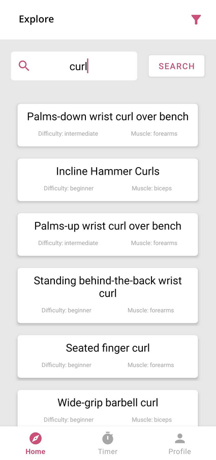
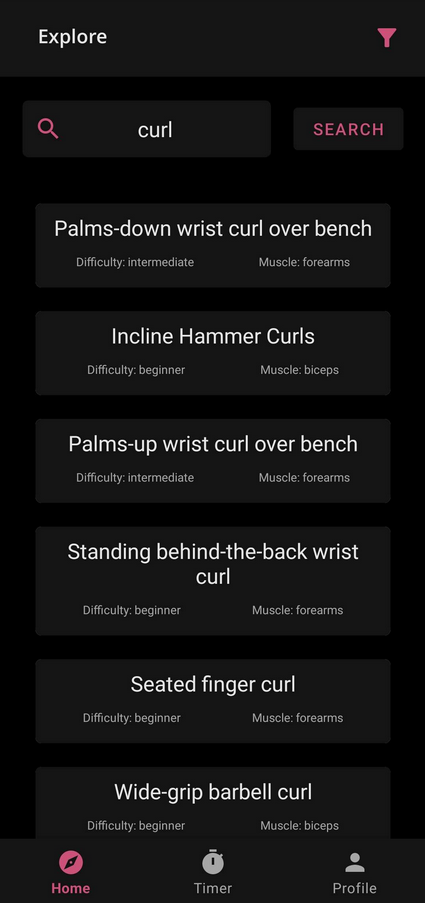

# Olympia Fitness

## Introduction

Olympia fitness is an app designed to find and store exercises and their information. This can be used to create workout routines, aswell as find new exercises to try that fit the requirements you need.

### **Home & Exercise Information Page**
On the home page the user may search by exercise name, to display a list of up to 10 exercises that are relevent. A filter menu is provided in the top action bar, where the user may filter by the muscle that the exercise works, the type of the exercise, or the difficulty of the exercise. Each item in the list is clickable, taking the user to an information page about the respective exercise, showing the name, muscle, type, difficulty and instructions on how to perform the exercise correctly (with the ability to scroll if needed). On this page, in the action bar, there is a button to add the exercise to the user's collection. This will download the exercise onto the device, and be displayed in the profile tab. The home, timer and profile tab may be navigated using the navigtion bar situated at the bottom of each screen.

### **Profile Page**
On the profile page, the user is shown a list of all the exercises that they have saved. Similar to the home page, each one is clickable and will take the user to the same information page, with the exception of the add button in the action bar, being replaced by a remove button. This will remove the exercise from the user's collection and phone storage. There is a button in the action bar of the profile page that provides a link to google maps showing gyms that are near the user (implicit intent).

### **Timer Page**
On the timer page the user may set an amount of time in minutes. They can then start, pause or reset the timer. The timer will continue if the app is closed.

---

## Design Rationale

### **Layout**

The bottom navigation bar is visible on the home, timer and profile activity to ensure a consistent layout across the app. Whilst the action bar is included on all screens (including the exercise information screen and both side menus), the content is changed depending on the activity. For example the title of the bar changes to the exercise name on the exercise information screen, while also providing a button to go back to the previous activity. I feel that having these consistent features makes the app feel more polished for the user.

### **Storage**

For data storage I decided to use internal storage, as the user would need to store the exercises for an undetermined amount of time, aswell as only this app needing access to the stored information.

 

### **Theme**

For the app I decided to pick a theme and colour palette early on, so that the different activities would all feel like they belong. The app has a light and dark theme, that are chosen based on the user's device preference. Both themes use the same pink accent colour, with the dark theme using black and dark grey primary colours, and the light theme using white and light grey primary colours.

 
 
 
 

### **Responsiveness**

On the same thought of making the app feeling polished, I have added click effects to everything that the user may press, in order to make the app feel more responsive. I have also made use of Toasts to display certain actions have been carried out properly.

### **API**

I made use of view models to store the data received from the API in order to ensure that the search request would be carried out if for example the screen orientation was changed. I have also created a seperate layout for the home screen in landscape mode, as the side menu was not displaying properly. I made the decision that caching the data collected from the API would not be necessary as the data is not being changed, therefore the logical thing would be to make use of a database, however, that would remove the need for an internet connection, which is outlined as a requirement in the specification.

---

## Challenges and The Future

### **Challenges**

Some challenges that I faced during the production of this project was the fact that I was using activities instead of fragments, which made certain features harder to implement. In the future I would switch from using activies to fragments, as this provides a smoother experience and is better practice, however I had already developed most of the app by the time we were taught about fragments, and made the decision that it would require too much reconfiguration within the given timeframe.

### **Improvements**
Whilst I am happy with the current state of the app, if the timeframe was increased, there are some features that I would wish to add. One of these would be the ability for the user to make notes on each exercise information page. I have spoken to people who have tried using my app, aswell as other similar apps, and the main piece of feedback was that being able to note down your progress on each exercise (for example how may sets/reps they reached, or what weight they are currently on) is a very useful tool when trying to progress in your body fitness. Another feature would be the timer displaying as a notification on the device.